# cyberdog_race 说明文档

## 1. 环境搭建

### 1.1 推荐环境配置

- Ubuntu 20.04
- Docker 20.10.21（安装教程：<https://docs.docker.com/engine/install/ubuntu/>）

### 1.2 Docker 镜像导入与运行

1. 下载 Docker 包 `cyberdog_race.tar`。
2. 本地导入 Docker 镜像：

```bash
sudo docker load -i cyberdog_race.tar
```

3. 授权 X Server：

```bash
xhost +
```

4. 运行 Docker 镜像：

```bash
sudo docker run -it --shm-size="1g" --privileged=true \
  -e DISPLAY=$DISPLAY \
  -v /tmp/.X11-unix:/tmp/.X11-unix \
  cyberdog_sim:v1
```

其中 `cyberdog_sim:v1` 需要修改为自己的镜像名称。

## 2. 仿真环境使用

仿真环境基于 Gazebo 仿真器。仿真器程序直接与控制程序 `cyberdog_control` 通信，并将机器人的各关节数据与传感器数据转发为 ROS2 topic，再通过 rviz 进行机器人状态可视化。

### 2.1 运行仿真环境

#### 2.1.1 脚本运行整个仿真环境

打开 Docker 后，在终端运行：

```bash
cd /home/cyberdog_sim
python3 src/cyberdog_simulator/cyberdog_gazebo/script/launchsim.py
```

运行后的仿真器共有 2 个界面：

- Gazebo 界面：仿真器界面，用于确认机器人与环境的交互。
- rviz2 界面：可视化界面，主要显示机器人自身状态与传感器返回数据。

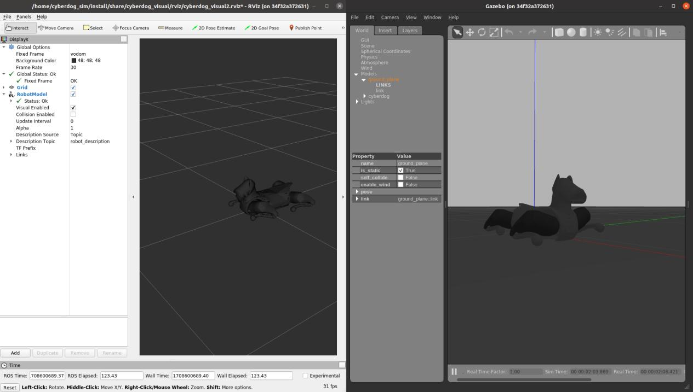

运行仿真器后弹出三个窗口：

- `cyberdog_gazebo`：仿真器程序界面。
- `cyberdog_control`：控制程序界面。
- `cyberdog_visual`：rviz2 可视化程序界面。

各界面会返回对应程序的状态以及发生的错误。

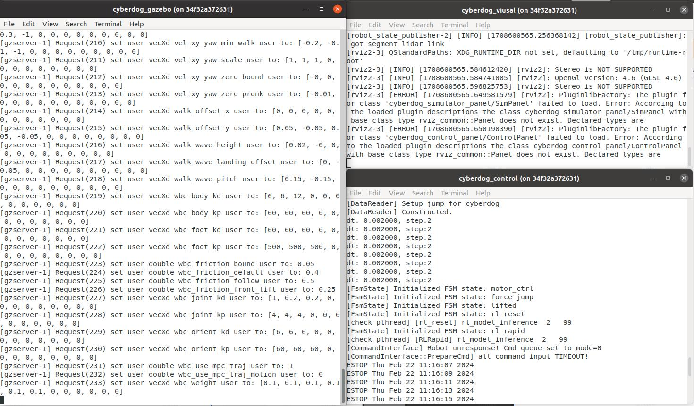

#### 2.1.2 导入镜像到打开仿真器的全流程视频

原 PDF 中标注视频文件：`tutorial.mp4`。

#### 2.1.3 分别运行各个程序

除脚本启动外，也可以分别运行各程序。

##### Gazebo 仿真程序

首先启动 Gazebo 程序，在 `cyberdog_sim` 文件夹下执行：

```bash
source /opt/ros/galactic/setup.bash
source install/setup.bash
ros2 launch cyberdog_gazebo race_gazebo.launch.py
```

也可以通过如下命令打开 Gazebo 仿真中的激光雷达传感器：

```bash
source /opt/ros/galactic/setup.bash
source install/setup.bash
ros2 launch cyberdog_gazebo race_gazebo.launch.py use_lidar:=true
```

注意：若启动 Gazebo 仿真程序时出现如下错误，是由于 Gazebo 程序没有彻底杀死导致。可通过在 Docker 终端运行以下命令彻底杀死进程后，重新运行仿真程序：

```bash
killall -9 gazebo
killall -9 gzserver
killall -9 gzclient
```

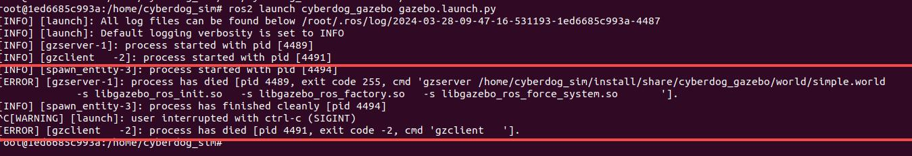

对于 Gazebo 进程无法通过 `Ctrl+C` 彻底杀死的问题，可以使用如下脚本运行 Gazebo。运行时在检测到 `Ctrl+C` 后，该脚本会自动杀死所有 Gazebo 进程。在 `cyberdog_sim` 文件夹下执行：

```bash
source /opt/ros/galactic/setup.bash
source install/setup.bash
chmod +x src/cyberdog_simulator/cyberdog_gazebo/script/gazebolauncher.py
python3 src/cyberdog_simulator/cyberdog_gazebo/script/gazebolauncher.py \
  ros2 launch cyberdog_gazebo gazebo.launch.py
```

##### cyberdog 控制程序

然后启动 `cyberdog_locomotion` 的控制程序。打开一个新的终端，在 `cyberdog_sim` 文件夹下运行：

```bash
source /opt/ros/galactic/setup.bash
source install/setup.bash
ros2 launch cyberdog_gazebo cyberdog_control_launch.py
```

##### rviz 可视化界面

最后打开可视化界面。打开一个新的终端，在 `cyberdog_sim` 文件夹下运行：

```bash
source /opt/ros/galactic/setup.bash
source install/setup.bash
ros2 launch cyberdog_visual cyberdog_visual.launch.py
```

### 2.2 仿真环境通信结构

与仿真环境中的机器人建立通信需要使用到 LCM 与 ROS2 topic 两种通信方式。

相关文档：

- LCM 通信：cyberdog blog 运动控制模块 1.2 节、LCM GitHub 库。
- ROS2 topic：ROS2 topic 官方文档。

#### 2.2.1 通信结构介绍

整个仿真环境的通信结构如下图所示：

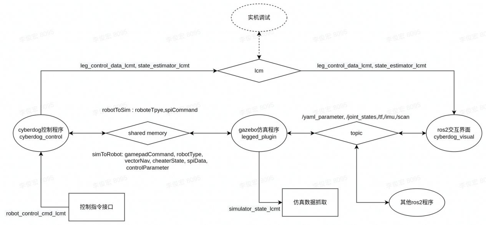

- `cyberdog_control` 控制程序和 Gazebo 之间通过 shared memory 进行通信。Gazebo 程序创建 host 的共享内存，控制程序通过 attach 到该内存上进行通信。通信内容为 `robotToSim` / `simToRobot`。
- ROS2 仿真界面接受从控制程序通过 LCM 发送的电机和里程计等信号，并通过 topic 转发为 `/joint_states` 与 `/tf`。
- Gazebo 仿真程序会将仿真中的 IMU 与激光雷达数据以 ROS2 topic 的形式发送，topic 名称为 `/imu` 和 `/scan`。

#### 2.2.2 机器人控制接口

##### LCM 通信

在仿真中，控制程序的高层接口也能够使用。可以通过 LCM 通信向控制程序发送指令，控制仿真中的机器人。具体功能与实现方法可参照运控文档的运动控制模块。

##### ROS2 topic 通信

在仿真中可以运行 motion manager。该程序能够提供一个 ROS2 topic 接口，将 ROS2 topic 的控制指令转换为 LCM 指令发送给控制程序。该部分的具体使用方法在后续会进行说明。

#### 2.2.3 机器人状态及传感器接口

仿真中机器人数据会以 LCM 和 ROS2 topic 的方式对外发送，可根据自身需求选择抓取数据的方式。

##### LCM 数据的抓取

LCM 数据可以在控制程序 `/home/cyberdog_sim/src/cyberdog_locomotion/script` 目录下使用 LCM 自带的 `lcm-logger` 抓取，然后使用第三方库 `log2smat` 将抓取的数据转换为 Matlab 的 `.mat` 文件。具体使用方法如下：

```bash
cd /home/cyberdog_sim/src/cyberdog_locomotion/script
./make_types.sh  # 安装后首次使用需运行该脚本以生成 lcm 的 type 文件
lcm-logger       # 可通过 Ctrl+C 退出数据抓取，会自动生成 lcm 的 log 文件
./log_convert <生成的 log 文件名> <要生成的 mat 文件名.mat>
```

也可以在 `script` 文件夹下运行 `launch_lcm_spy.sh` 脚本实时显示 LCM 数据。

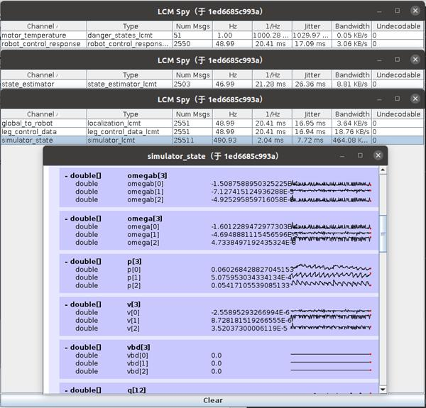

仿真程序发送的 LCM 数据 `simulator_state` 结构如下（`simulator_lcmt.lcm`）：

```c
struct simulator_lcmt {
  double vb[3];       // 机身坐标系下 xyz 速度
  double rpy[3];      // 翻滚角 俯仰角 偏航角

  int64_t timesteps;  // 实际时间戳
  double time;
  double quat[4];     // 机身朝向四元数
  double R[9];        // 机身朝向旋转矩阵
  double omegab[3];   // 机身坐标系下角速度
  double omega[3];    // 机身角速度
  double p[3];        // 机身位置
  double v[3];        // 机身速度
  double vbd[3];      // 机身加速度
  double q[12];       // 关节位置
  double qd[12];      // 关节速度
  double qdd[12];     // 关节加速度
  double tau[12];     // 关节输出转矩
  double tauAct[12];  // 关节
  double f_foot[12];  // 足端接触力 xyz 方向分量
  double p_foot[12];  // 足端位置 xyz 坐标
}
```

其中未提及坐标的数据皆为世界坐标系下的数据。

关节相关数据的顺序为：FR-侧摆髋关节、FR-前摆髋关节、FR-膝关节、FL-侧摆髋关节、FL-前摆髋关节、FL-膝关节、RR-侧摆髋关节、RR-前摆髋关节、RR-膝关节、RL-侧摆髋关节、RL-前摆髋关节、RL-膝关节。

足端相关数据的顺序为：FR、FL、RR、RL。

##### ROS2 topic 数据

仿真平台会以标准 ROS2 topic 发送 `/tf2`（里程计与各 link 坐标转换）、`/joint_states`（各关节状态）、`/imu`（IMU 加速度数据）。具体可参照：

- `sensor_msgs` 文档
- `tf2` 官方文档

相应地，在 Gazebo 中通过官方插件加入的传感器也能够通过 ROS topic 发送数据，该部分将在下一节具体说明。

### 2.3 传感器加入与使用

仿真模型中，对应实际机器的传感器位置设置了对应的 link，可通过直接在对应的 link 上添加传感器插件来在仿真中使用不同的传感器。

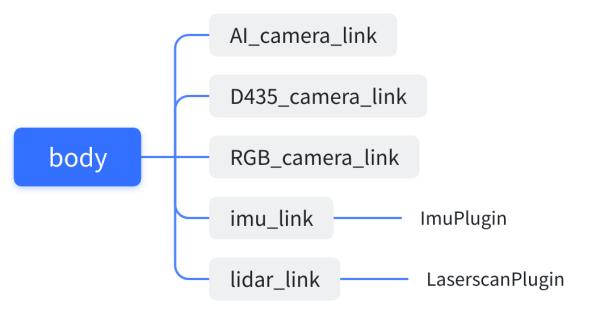

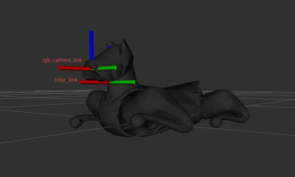

目前使用传感器插件有两个途径：

- Gazebo 官方支持传感插件。
- 通过 GitHub 获取一些 Gazebo 第三方插件。

本节以机器人颈部的激光雷达为例，介绍在仿真中如何加入和使用传感器插件。

#### 2.3.1 在机器人模型中加入传感器插件

首先，需要在 `/home/cyberdog_sim/src/cyberdog_simulator/cyberdog_robot/cyberdog_description/xacro` 文件夹下的机器人描述文件中的对应 link 上增加传感器。

该 xacro 文件与 URDF（机器人描述文件）的资料见：

- xacro file wiki
- URDF wiki

可以通过 `robot.xacro` 确认模型中的传感器 link，并在 `gazebo.xacro` 中进行传感器创建。

1. 找到 `robot.xacro` 中需要增加传感器的对应 link。
2. 在 `gazebo.xacro` 的 `<robot>` 下增加如下代码，加入激光雷达传感器：

```xml
<gazebo reference="lidar_link">              <!-- 传感器所在 link 名称 -->
  <sensor name="realsense" type="ray">       <!-- 传感器的参数设置 -->
    <always_on>true</always_on>
    <visualize>true</visualize>
    <pose>0.0 0 0.0 0 0 0</pose>
    <update_rate>5</update_rate>
    <ray>
      <scan>
        <horizontal>
          <samples>180</samples>
          <resolution>1.000000</resolution>
          <min_angle>-1.5700</min_angle>
          <max_angle>1.5700</max_angle>
        </horizontal>
      </scan>
      <range>
        <min>0.01</min>
        <max>12.00</max>
        <resolution>0.015000</resolution>
      </range>
      <noise>
        <type>gaussian</type>
        <mean>0.0</mean>
        <stddev>0.01</stddev>
      </noise>
    </ray>
    <plugin name="cyberdog_laserscan" filename="libgazebo_ros_ray_sensor.so">
      <ros>
        <remapping>~/out:=scan</remapping>   <!-- 传感器返回数据 topic 的名称 -->
      </ros>
      <output_type>sensor_msgs/LaserScan</output_type>
      <frame_name>lidar_link</frame_name>    <!-- 传感器所在 link 名称 -->
    </plugin>
  </sensor>
</gazebo>
```

3. 保存后启动仿真器，确认传感器是否生效。

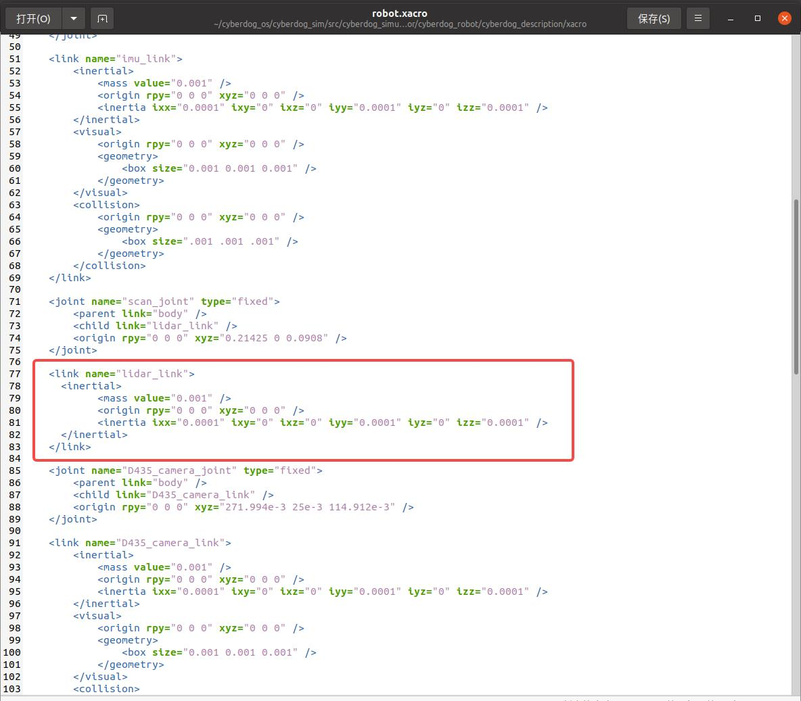

此处设置的激光雷达与实机激光雷达位置一致，且会进行正前方 180 度、12m 范围的扫描。

#### 2.3.2 确认传感器的数据与可视化

##### 确认传感器 topic 正确发送

官方传感器插件会根据在 `gazebo.xacro` 中设置的 `<remapping>` 发送相同名称的 topic，格式为 `<output_type>` 中的内容。

因此，可通过在 Docker 终端中输入 `ros2 topic list` 指令查看当前的 ROS2 topic 是否存在 `/scan` topic，并通过 `ros2 topic echo /scan` 打印出 topic 的内容。

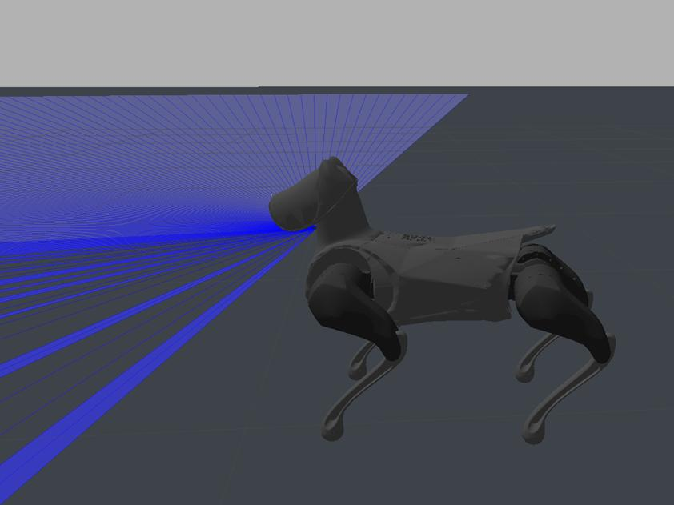

topic 中各数据含义可通过查询 wiki 进行查询。激光雷达的 topic 类型 `sensor_msgs/LaserScan` 格式如下：

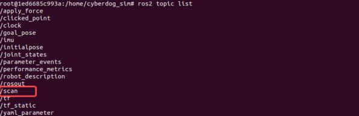

至此，完成传感器在仿真环境中的导入，并能够通过建立 ROS2 Node 接受和处理传感器返回的数据，实现对传感器的利用。

##### 传感器数据的可视化

rviz2 可视化界面能够支持大部分 Gazebo 传感器数据的显示。

以激光雷达为例，在确认激光雷达 topic 正常发送后，能够通过 rviz2 可视化激光雷达返回的数据，步骤如下：

1. 运行仿真程序，并打开可视化界面。点击左侧 display 下方的 Add 按钮，打开 Add 界面，点击 By topic 选项卡。

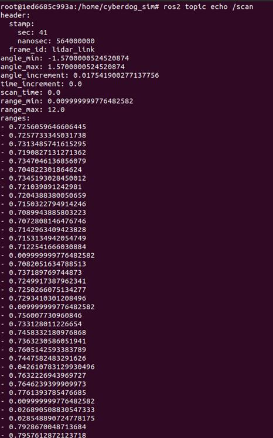

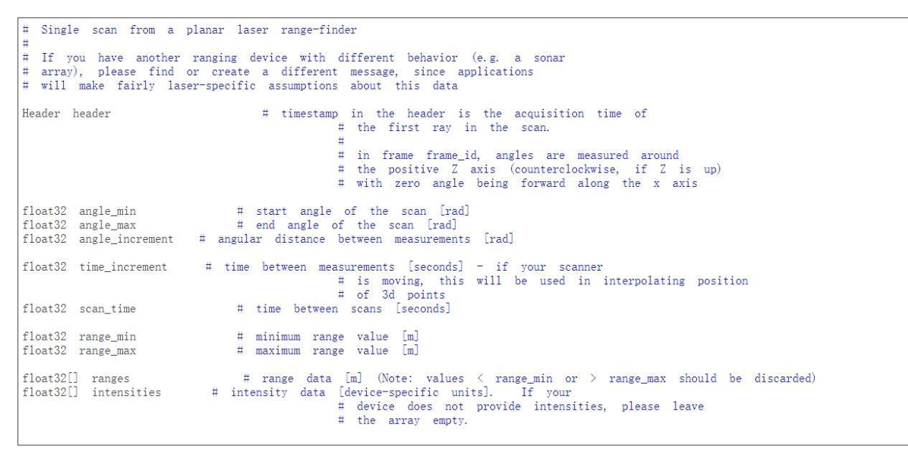

2. 此时，可确认所有正在通信的 topic。若传感器对应 topic 正常发送且 rviz2 能够进行可视化，则会出现彩色的选项。双击打开对应选项后，在 display 界面出现对应的下拉菜单。

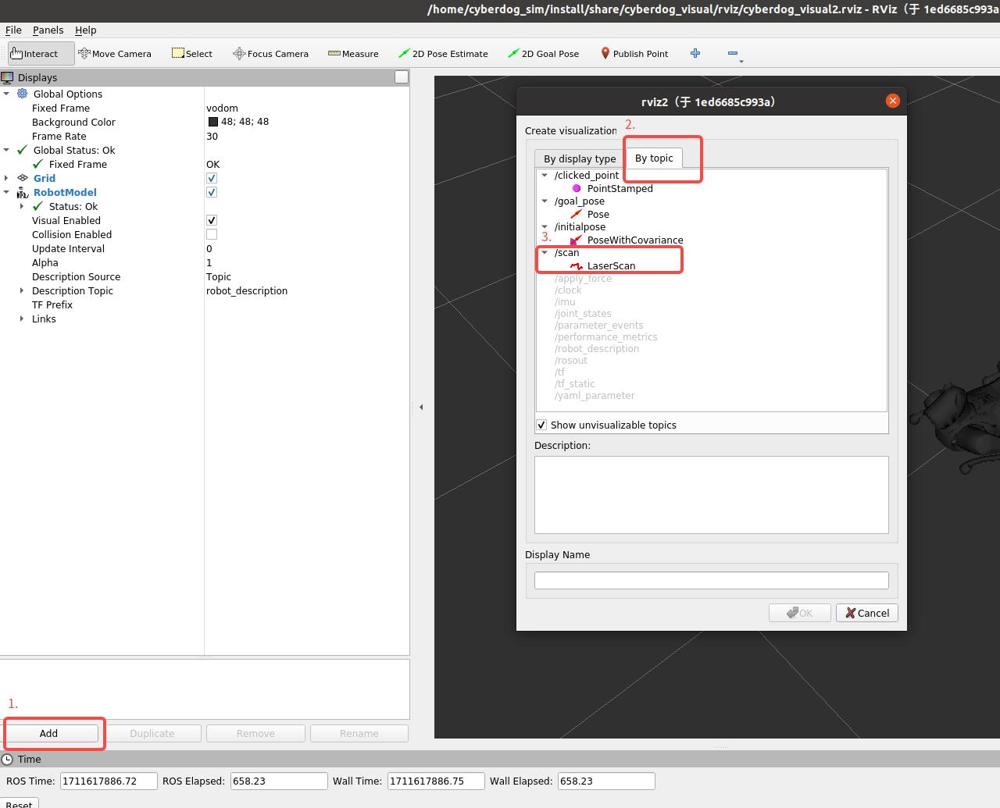

3. 打开下拉菜单，将 Reliability Policy 改为 Best Effort 后，rviz 就能够可视化激光雷达扫描得到的点云。

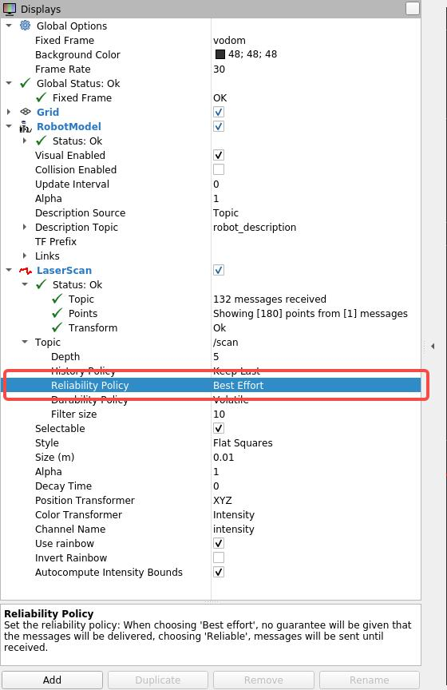

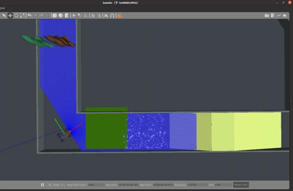

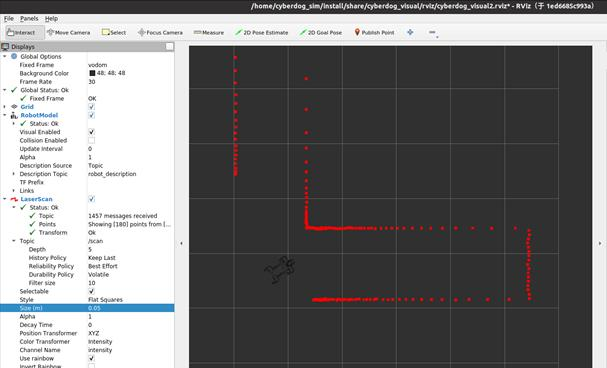

### 2.4 世界模型的创建

通过设置仿真器世界文件，可以实现仿真环境改动，以方便调试。

仿真场景的文件存放在 Docker 的 `/home/cyberdog_sim/src/cyberdog_simulator/cyberdog_gazebo/world` 目录下，场景文件后缀为 `.world`，使用 SDF（Simulation Description Format）格式。

目前仿真器默认打开 `race.world` 场景。可通过修改或创建新的场景文件来设计需要的仿真场景。

当设计完成后，可通过更改 `/home/cyberdog_sim/src/cyberdog_simulator/cyberdog_gazebo/launch` 目录下的 `race_gazebo.launch.py` 文件加载对应场景。只需将 `wname` 部分的名称改成对应场景 `.world` 文件的名称并保存，此时运行仿真程序即可加载对应场景。

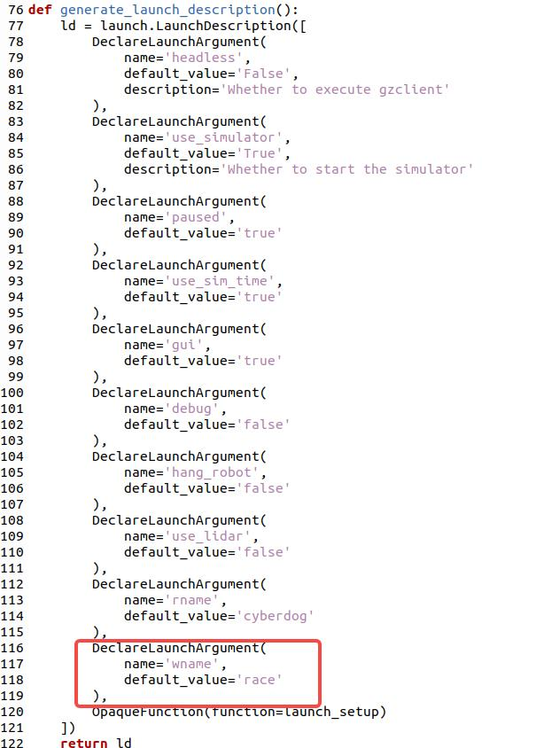

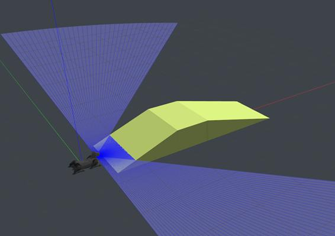
