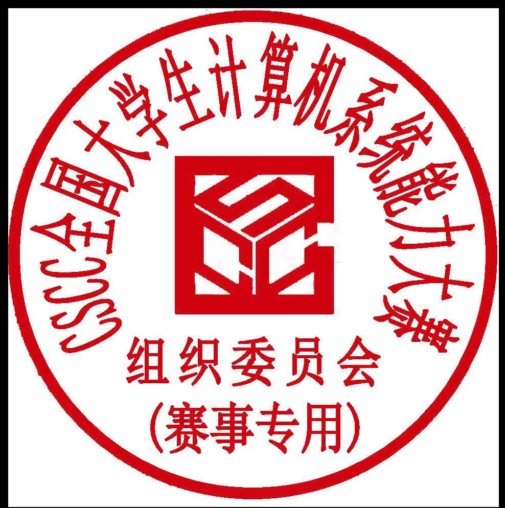

# 2026 年全国大学生计算机系统能力大赛智能系统创新设计赛（小米杯）章程

全国高等学校计算机教育研究会  
全国大学生计算机系统能力大赛组委会

## 一、竞赛总则

全国大学生计算机系统能力大赛（以下简称“大赛”）是由系统能力培养研究专家组发起，由全国高校计算机教育研究会、系统能力培养研究专家组和系统培养研究项目发起高校主办的面向高校大学生的全国性大赛。大赛目标是以学科竞赛推动专业建设和计算机领域创新人才培养体系改革，培育我国高端芯片、关键基础软件的后备人才。

大赛鼓励学生设计、实现综合性的计算机系统，培养系统级的设计、分析、优化与应用能力，提升学生的技术创新、工程实践、团队协作能力。大赛服务国家人才培养战略，以赛促学、以赛促教，为高水平计算机人才成长搭建交流、展示、合作的开放平台。

智能系统创新设计赛（小米杯）是全国大学生计算机系统能力大赛的一个赛道，旨在培养学生在智能系统领域的研究、设计、开发和应用能力，要求所有参赛作品具有“创新可展现”的特点。

## 二、竞赛组织

- 主办单位：全国高等学校计算机教育研究会、系统能力培养教学研究专家组、武汉大学
- 承办单位：武汉大学
- 协办单位：小米科技有限责任公司、机械工业出版社
- 秘书处：武汉大学计算机学院

## 三、竞赛形式与过程

智能系统创新设计赛（小米杯）设初赛和总决赛两个阶段，初赛胜出者有资格参加全国总决赛。

参赛者根据要求对指定的命题设计关键解决方案，在指定的平台上进行实现。竞赛作品根据题目要求的功能与性能指标进行评比。

## 四、参赛对象

1. 智能系统创新设计赛（小米杯）的参赛对象为全国普通高等学校全日制在校本科生。
2. 参赛对象的在校生身份以报名时为准。

## 五、赛事流程

### 5.1 时间安排

#### 5.1.1 报名阶段

| 日期 | 安排 |
| --- | --- |
| 2026 年 3 月 9 日 | 报名启动 |
| 2026 年 5 月 27 日 | 报名截止 |
| 2026 年 3 月 2 日 | 发布赛题及评测技术指标 |

#### 5.1.2 初赛过程

- 2026 年 6 月 1 日前，各参赛队在线提交参赛作品。
- 所有初赛作品要求提供设计文档、真实环境或仿真环境下实际执行结果的视频和全部源代码，并将相关内容上传到智能系统创新设计赛指定的平台。
- 2026 年 6 月 15 日前，评审组对参赛作品进行评审，评选出入围全国总决赛的作品和参赛队。
- 2026 年 6 月 15 日公布初赛成绩及全国总决赛入围名单。
- 报名和初赛期间会安排相应技术培训。

#### 5.1.3 全国总决赛

2026 年 8 月下旬举行全国总决赛。总决赛线下进行，所有参赛队应参加总决赛现场比赛，使用真实设备在实际场地完成现场比赛。不到现场的参赛队，视为弃权决赛。

总决赛评审以参赛队为单位进行，具体要求在决赛通知中公布。

全国总决赛的具体安排请参赛队关注决赛通知并按要求执行。

### 5.2 报名资格

1. 比赛采取组队竞赛的方式，参赛队为报名的基本单位。每支参赛队的学生人数为 1-4 人，同一高校的参赛队数量没有限制，但是来自不同学校的学生不能联合组队参赛。
2. 每位参赛学生只能参加一支参赛队，不可重复报名。
3. 每个参赛队至少要有一位指导教师，最多有两位指导教师。指导教师可以是高校教师或企业技术专家，每位高校指导教师可同时指导本校多支参赛队。指导教师负责督促学生参加赛前技术培训、指导相关的创新设计与实现，同时负责在比赛过程中与学校及组委会之间的信息沟通。
4. 2026 年 6 月 1 日之前，各参赛队有一次机会调整参赛队员，参赛队可更换、增加或减少一名队员，调整前后的队员名单经指导教师签字后发送至大赛邮箱，由秘书处审核备案。6 月 1 日之后，参赛队只能减少参赛队员，不能更换、增加参赛队员。最终参赛队员名单以大赛系统中的名单为准。

### 5.3 报名方式

1. 登录竞赛网站 <https://is.educg.net/>，填写相关信息，并按要求提供相关材料，进行在线报名。
2. 报名者需提供能证明本人身份的学生证/教师工作证。将上述报名材料扫描后并打包为单个文件，上传至在线报名页面，收到组委会邮件或短信确认后，报名工作完成。

### 5.4 参赛费用

1. 智能系统创新设计赛不收取报名费、参赛费、评审费、技术平台购买费等任何费用。
2. 参赛队员及指导老师在全国总决赛期间产生的交通、住宿、用餐等费用自理。

## 六、奖项设置

### 6.1 总决赛奖项设置

| 奖项 | 数量或比例 |
| --- | --- |
| 特等奖（小米杯） | 1 名 |
| 一等奖 | 不低于决赛队数量的 30% |
| 二等奖 | 不低于决赛队数量的 30% |
| 三等奖 | 若干 |

特等奖根据作品质量可能空缺。一、二、三等奖的具体数量将根据当年报名参赛队总数适当调整。

所有获奖者都将获颁证书和团队奖金，纳税事宜由获奖者自行处理。

### 6.2 指导教师奖

所有获得全国总决赛奖项的团队的指导教师（高校教师或企业技术专家）均可获得“优秀指导教师”奖及证书。

## 七、知识产权与学术诚信

1. 参赛作品的知识产权归参赛单位和参赛队所有。
2. 参赛作品的源代码需遵循开源协议，如 GPL-3 协议、Apache 协议、BSD 协议、木兰协议等，参赛作品的文档遵循开源协议 CC-BY-SA 4.0。
3. 比赛代码仓库在比赛结束后保持公开（public）状态。
4. 参赛队应自觉遵守知识产权和各种开源协议的有关法规和规定，并在报名表中承诺、确认不得侵犯他人的知识产权或其他权益。如造成不良后果，由参赛队自行承担相关法律责任，竞赛的主办、承办和协办方均不负任何法律责任。
5. 参赛队必须严守诚信。组委会将对所有参赛作品的代码和文档组织查重检查，一经发现恶意代码、技术抄袭等学术不端行为，或确认参赛者身份不符合章程要求等违规行为，经大赛监督委员会组织的匿名评议确认后，将取消参赛队的参赛资格。对于已经获得奖项的参赛队，通报所在学校，并取消和追回已获得的证书和奖金。

## 八、交流与宣传

1. 智能系统创新设计赛致力于推动高校智能系统相关能力培养以及创新实践活动的开展，鼓励参赛队间各种形式的交流活动，并积极宣传优秀作品和参赛团队。
2. 大赛指定竞赛网站 <https://is.educg.net/>、计算机系统能力培养微信公众号为发布本赛事新闻、技术资料、培训活动、比赛结果等的官方平台，本赛事的相关通知均以上述平台发布的信息为准。
3. 智能系统创新设计赛欢迎社会各界共同参与智能系统创新设计赛的组织、命题、宣传、赞助等工作，积极争取各级管理部门的认可，不断提升智能系统创新设计赛的质量和影响力。
4. 面向智能系统创新设计赛组织的技术报告、交流和学术活动等，如涉及视频、文档、源代码等均在征得著作权人同意的情况下开源发布。
5. 本章程和技术方案将发至各高校教务部门和相关院系，希望学校制定鼓励学生和老师参赛的相关政策。

## 九、联系方式

1. 智能系统创新设计赛联系邮箱：<cscc-is@hz.cmpbook.com>
2. 联系电话：027-68775091（报名流程及事项咨询）
3. QQ 群：849808130

## 十、其他

1. 如因不可抗力或其他突发、特殊情况等必须对比赛各环节进行调整，以智能系统创新设计赛技术委员会在官方平台发布的通知为准。
2. 获奖证书由全国大学生计算机系统能力大赛组委会统一生成电子证书，并可在大赛网站查询、下载。对于包含多个成员的参赛队，证书在获奖成员列表处印制参赛队员姓名，不体现参赛队的队伍名称。获奖成员列表由获奖参赛队的队员/指导教师商议确定并书面报送大赛邮箱。若参赛队未按要求给出获奖成员列表，则获奖成员列表与报名系统中成员排序保持一致。
3. 本章程的解释权归智能系统创新设计赛技术委员会。

全国高等学校计算机教育研究会  
全国大学生计算机系统能力大赛组委会  
智能系统创新设计赛（小米杯）技术委员会  
2026 年 3 月
